# LangChain Restaurant Name Suggester - Complete Guide

A comprehensive journey through LangChain framework, starting with a simple restaurant name suggester and evolving into a multi-agent system with Wikipedia search, web search, and conversation memory.

## 📋 Table of Contents

- [Introduction to LangChain](#introduction-to-langchain)
- [Project 1: Restaurant Name Suggester](#project-1-restaurant-name-suggester)
- [Project 2: Wikipedia Agent](#project-2-wikipedia-agent)
- [Project 3: SerpAPI Web Search Agent](#project-3-serpapi-web-search-agent)
- [Project 4: Memory Agent](#project-4-memory-agent)
- [Project 5: Combined Multi-Agent System](#project-5-combined-multi-agent-system)
- [Installation & Setup](#installation--setup)
- [Technical Deep Dive](#technical-deep-dive)

## 🚀 Introduction to LangChain

LangChain is a powerful framework for developing applications powered by language models. It provides:

- **LLM Integration**: Easy connection to various language models (OpenAI, Anthropic, etc.)
- **Prompt Management**: Templates and dynamic prompt construction
- **Memory Systems**: Conversation history and context management
- **Tool Integration**: Connect LLMs to external APIs and services
- **Agent Framework**: Build autonomous AI agents that can reason and act

### Core Concepts

```python
# Basic LangChain structure
from langchain_openai import ChatOpenAI
from langchain_core.prompts import ChatPromptTemplate

# Initialize LLM
llm = ChatOpenAI(temperature=0.7)

# Create prompt template
prompt = ChatPromptTemplate.from_template("Tell me about {topic}")

# Chain them together
chain = prompt | llm

# Execute
result = chain.invoke({"topic": "artificial intelligence"})
```

### Project Architecture Evolution

```
🍽️ Project 1: Restaurant Suggester
    ↓
📚 Project 2: Wikipedia Agent  
    ↓
🌐 Project 3: SerpAPI Agent
    ↓
🧠 Project 4: Memory Agent
    ↓
🔄 Project 5: Combined System

┌─────────────────────┐    ┌─────────────────────┐
│ Simple Prompt + LLM │ ──→ │ 🍽️ Restaurant      │
└─────────────────────┘    │   Suggester        │
                           └─────────────────────┘
                                      ↓
┌─────────────────────┐    ┌─────────────────────┐
│ LLM + External API  │ ──→ │ 📚 Wikipedia       │
└─────────────────────┘    │   Agent            │
                           └─────────────────────┘
                                      ↓
┌─────────────────────┐    ┌─────────────────────┐
│ LLM + Real-time     │ ──→ │ 🌐 SerpAPI         │
│ Data                │    │   Agent            │
└─────────────────────┘    └─────────────────────┘
                                      ↓
┌─────────────────────┐    ┌─────────────────────┐
│ LLM + Conversation  │ ──→ │ 🧠 Memory          │
│ Memory              │    │   Agent            │
└─────────────────────┘    └─────────────────────┘
                                      ↓
┌─────────────────────┐    ┌─────────────────────┐
│ Intelligent Agent   │ ──→ │ 🔄 Combined        │
│ Router              │    │   System           │
└─────────────────────┘    └─────────────────────┘
```

## 🍽️ Project 1: Restaurant Name Suggester

Let's start with a simple restaurant name suggester to understand LangChain basics.

### Basic Implementation

```python
import os
from dotenv import load_dotenv
from langchain_openai import ChatOpenAI
from langchain_core.prompts import ChatPromptTemplate

load_dotenv()

# Initialize the LLM
llm = ChatOpenAI(
    temperature=0.7,  # Higher temperature for creative names
    openai_api_key=os.getenv("OPENAI_API_KEY")
)

# Create a prompt template
prompt_template = ChatPromptTemplate.from_template(
    """You are a creative restaurant naming expert. 
    Generate 5 unique and catchy restaurant names for a {cuisine_type} restaurant.
    The restaurant should have a {atmosphere} atmosphere.
    
    Provide names that are:
    - Memorable and easy to pronounce
    - Relevant to the cuisine type
    - Suitable for the atmosphere
    
    Cuisine: {cuisine_type}
    Atmosphere: {atmosphere}
    
    Restaurant Names:"""
)

def suggest_restaurant_names(cuisine_type, atmosphere):
    """Generate restaurant name suggestions"""
    # Create the chain
    chain = prompt_template | llm
    
    # Execute the chain
    response = chain.invoke({
        "cuisine_type": cuisine_type,
        "atmosphere": atmosphere
    })
    
    return response.content
```

### Architecture Diagram

```
┌─────────────────┐    ┌─────────────────┐    ┌─────────────────┐
│   User Input    │───→│ Prompt Template │───→│ LangChain Chain │
│ Cuisine +       │    │ {cuisine_type}  │    │  prompt | llm   │
│ Atmosphere      │    │ {atmosphere}    │    │                 │
└─────────────────┘    └─────────────────┘    └─────────────────┘
                                                        │
                                                        ▼
┌─────────────────┐    ┌─────────────────┐
│ Creative Names  │◄───│   OpenAI GPT    │
│    Output       │    │ temperature=0.7 │
└─────────────────┘    └─────────────────┘

Flow: Input → Template → Chain → LLM → Creative Output
```

### Key Learning Points

1. **Temperature Setting**: Higher values (0.7) for creativity, lower (0.1) for consistency
2. **Prompt Engineering**: Clear instructions lead to better outputs
3. **Template Variables**: Use `{variable}` for dynamic content
4. **Chain Composition**: `prompt | llm` creates a processing pipeline

## 📚 Project 2: Wikipedia Agent

Now let's add external data sources using Wikipedia integration.

### Implementation

```python
import os
from dotenv import load_dotenv
from langchain_openai import ChatOpenAI
from langchain_community.tools import WikipediaQueryRun
from langchain_community.utilities import WikipediaAPIWrapper

load_dotenv()

# Initialize components
llm = ChatOpenAI(temperature=0, openai_api_key=os.getenv("OPENAI_API_KEY"))
wikipedia = WikipediaQueryRun(api_wrapper=WikipediaAPIWrapper())

def search_wikipedia(query: str) -> str:
    """Search Wikipedia and return summarized results"""
    try:
        result = wikipedia.run(query)
        # Limit response length for better processing
        return result[:500] + "..." if len(result) > 500 else result
    except Exception as e:
        return f"Error searching Wikipedia: {str(e)}"

def ask_with_wikipedia(question: str) -> str:
    """Answer questions using Wikipedia knowledge"""
    # Get Wikipedia information
    wiki_info = search_wikipedia(question)
    
    # Use LLM to provide a comprehensive answer
    prompt = f"""Based on this Wikipedia information: {wiki_info}
    
    Please provide a clear and informative answer to: {question}
    
    Make the answer concise but comprehensive."""
    
    response = llm.invoke(prompt)
    return response.content
```

### Architecture Diagram

```
┌─────────────────┐
│ User Question   │
└─────────┬───────┘
          ▼
┌─────────────────┐    ┌─────────────────┐
│ Wikipedia Search│───→│ Wikipedia API   │
│WikipediaQueryRun│    │   Raw Data      │
└─────────────────┘    └─────────┬───────┘
          │                      ▼
          │            ┌─────────────────┐
          │            │Response Process │
          │            │Truncate 500char│
          │            └─────────┬───────┘
          ▼                      ▼
┌─────────────────┐    ┌─────────────────┐
│ Error Handling  │───→│  LLM Synthesis  │
│   Graceful      │    │   ChatOpenAI    │
│   Fallback      │    └─────────┬───────┘
└─────────────────┘              ▼
                        ┌─────────────────┐
                        │Formatted Answer │
                        └─────────────────┘

Flow: Question → Wikipedia → Process → LLM → Answer
```

### Key Learning Points

1. **Tool Integration**: LangChain provides wrappers for external APIs
2. **Error Handling**: Always handle API failures gracefully
3. **Response Processing**: Truncate long responses for better LLM processing
4. **Information Synthesis**: LLM combines external data with reasoning

## 🌐 Project 3: SerpAPI Web Search Agent

Add real-time web search capabilities for current information.

### Implementation

```python
import os
from dotenv import load_dotenv
from langchain_openai import ChatOpenAI
from langchain_community.utilities import SerpAPIWrapper

load_dotenv()

# Initialize components
llm = ChatOpenAI(temperature=0, openai_api_key=os.getenv("OPENAI_API_KEY"))
serpapi = SerpAPIWrapper(serpapi_api_key=os.getenv("SERPAPI_API_KEY"))

def search_web(query: str) -> str:
    """Search the web using SerpAPI"""
    try:
        result = serpapi.run(query)
        return str(result)
    except Exception as e:
        return f"Error searching web: {str(e)}"

def ask_with_search(question: str) -> str:
    """Answer questions using web search"""
    # Search for current information
    search_result = search_web(question)
    
    # Use LLM to synthesize the information
    prompt = f"""Based on this web search result: {search_result}
    
    Please provide a clear and up-to-date answer to: {question}
    
    Focus on the most relevant and recent information."""
    
    response = llm.invoke(prompt)
    return response.content
```

### Architecture Diagram

```
┌─────────────────┐
│   User Query    │
│Current Info Need│
└─────────┬───────┘
          ▼
┌─────────────────┐    ┌─────────────────┐
│  SerpAPI Search │───→│Web Search Result│
│ SerpAPIWrapper  │    │ Real-time Data  │
└─────────────────┘    └─────────┬───────┘
          ▲                      ▼
          │            ┌─────────────────┐
┌─────────────────┐    │Result Processing│
│ API Rate Limits │    │Raw to Structured│
│ Error Handling  │    └─────────┬───────┘
└─────────────────┘              ▼
          │            ┌─────────────────┐
          └───────────→│  LLM Analysis   │
                       │   ChatOpenAI    │
                       └─────────┬───────┘
                                 ▼
                       ┌─────────────────┐
                       │ Current Answer  │
                       │Up-to-date Info │
                       └─────────────────┘

Flow: Query → SerpAPI → Process → LLM → Current Answer
```

### Key Learning Points

1. **Real-time Data**: Web search provides current information
2. **API Integration**: SerpAPI wrapper handles search complexity
3. **Data Synthesis**: LLM processes raw search results into answers
4. **Current Events**: Perfect for time-sensitive queries

## 🧠 Project 4: Memory Agent

Implement conversation memory for context-aware interactions.

### Implementation

```python
import os
from dotenv import load_dotenv
from langchain_openai import ChatOpenAI

# Custom memory implementation
class SimpleMemory:
    def __init__(self, k=5):
        self.k = k  # Number of conversations to remember
        self.conversations = []
    
    def save_context(self, inputs, outputs):
        """Save conversation to memory"""
        self.conversations.append({
            "input": inputs["input"], 
            "output": outputs["output"]
        })
        # Keep only last k conversations
        if len(self.conversations) > self.k:
            self.conversations.pop(0)
    
    @property
    def buffer(self):
        """Get formatted conversation history"""
        return "\n".join([
            f"Human: {conv['input']}\nAI: {conv['output']}" 
            for conv in self.conversations
        ])
    
    def get_context(self):
        """Get conversation context for prompts"""
        return self.buffer

load_dotenv()

# Initialize components
llm = ChatOpenAI(temperature=0, openai_api_key=os.getenv("OPENAI_API_KEY"))
memory = SimpleMemory(k=5)

def ask_with_memory(question: str) -> str:
    """Ask questions with conversation memory"""
    # Get conversation context
    context = memory.get_context()
    
    # Build prompt with context
    if context:
        prompt = f"""Previous conversation:
{context}

Human: {question}
AI:"""
    else:
        prompt = f"Human: {question}\nAI:"
    
    response = llm.invoke(prompt)
    answer = response.content
    
    # Save to memory
    memory.save_context({"input": question}, {"output": answer})
    return answer
```

### Architecture Diagram

```
┌─────────────────┐
│   User Input    │
└─────────┬───────┘
          ▼
┌─────────────────┐
│  Memory Check   │
│  get_context()  │
└─────────┬───────┘
          ▼
     ┌─────────┐
     │Has      │
     │Context? │
     └────┬────┘
      Yes │ No
    ┌─────▼─────┐         ┌─────────────────┐
    │Build      │         │ Simple Prompt   │
    │Contextual │         │ Current Only    │
    │Prompt     │         └─────────┬───────┘
    └─────┬─────┘                   │
          └─────────┬─────────────────┘
                    ▼
          ┌─────────────────┐
          │ LLM Processing  │
          │   ChatOpenAI    │
          └─────────┬───────┘
                    ▼
          ┌─────────────────┐
          │Generate Response│
          └─────────┬───────┘
                    ▼
          ┌─────────────────┐    ┌─────────────────┐
          │Save to Memory   │───→│ Memory Buffer   │
          │save_context()   │    │Sliding Window   │
          └─────────────────┘    │    (k=5)        │
                    │            └─────────────────┘
                    ▼                      ▲
          ┌─────────────────┐              │
          │ Return Answer   │              │
          └─────────────────┘              │
                                          │
                              ┌─────────────────┐
                              │Memory Management│
                              │  Auto-cleanup   │
                              └─────────────────┘

Flow: Input → Memory Check → Context Decision → LLM → Save → Answer
```

### Key Learning Points

1. **Memory Management**: Custom implementation for conversation history
2. **Context Building**: Include previous conversations in prompts
3. **Sliding Window**: Keep only recent conversations to manage token limits
4. **State Management**: Maintain conversation state across interactions

## 🔄 Project 5: Combined Multi-Agent System

Bring everything together in a unified system that intelligently routes queries to the appropriate agent.

### Architecture Overview

```
┌─────────────────┐    ┌─────────────────┐    ┌─────────────────┐
│   Wikipedia     │    │    SerpAPI      │    │     Memory      │
│     Agent       │    │     Agent       │    │     Agent       │
└─────────────────┘    └─────────────────┘    └─────────────────┘
         │                       │                       │
         └───────────────────────┼───────────────────────┘
                                 │
                    ┌─────────────────┐
                    │   Main Agent    │
                    │  (Router)       │
                    └─────────────────┘
```

### Implementation

```python
import os
from dotenv import load_dotenv
from langchain_openai import ChatOpenAI
from langchain_community.tools import WikipediaQueryRun
from langchain_community.utilities import WikipediaAPIWrapper, SerpAPIWrapper

# Import our custom memory
class SimpleMemory:
    def __init__(self, k=3):
        self.k = k
        self.conversations = []
    
    def save_context(self, inputs, outputs):
        self.conversations.append({"input": inputs["input"], "output": outputs["output"]})
        if len(self.conversations) > self.k:
            self.conversations.pop(0)
    
    def get_context(self):
        return "\n".join([f"Human: {conv['input']}\nAI: {conv['output']}" for conv in self.conversations])

load_dotenv()

# Initialize all components
llm = ChatOpenAI(temperature=0, openai_api_key=os.getenv("OPENAI_API_KEY"))
wikipedia = WikipediaQueryRun(api_wrapper=WikipediaAPIWrapper())
serpapi = SerpAPIWrapper(serpapi_api_key=os.getenv("SERPAPI_API_KEY"))
memory = SimpleMemory(k=3)

def intelligent_agent(question: str) -> str:
    """Route questions to appropriate agent based on content"""
    question_lower = question.lower()
    
    # Route to Wikipedia for factual/historical queries
    if any(word in question_lower for word in ['what is', 'who was', 'tell me about', 'explain']):
        wiki_result = wikipedia.run(question)[:500]
        prompt = f"Based on Wikipedia: {wiki_result}\n\nAnswer: {question}"
        response = llm.invoke(prompt)
        answer = response.content
    
    # Route to SerpAPI for current information
    elif any(word in question_lower for word in ['current', 'latest', 'today', 'weather', 'news']):
        search_result = serpapi.run(question)
        prompt = f"Based on search: {search_result}\n\nAnswer: {question}"
        response = llm.invoke(prompt)
        answer = response.content
    
    # Use memory for conversational queries
    else:
        context = memory.get_context()
        if context:
            prompt = f"Previous conversation:\n{context}\n\nHuman: {question}\nAI:"
        else:
            prompt = f"Human: {question}\nAI:"
        response = llm.invoke(prompt)
        answer = response.content
    
    # Save to memory
    memory.save_context({"input": question}, {"output": answer})
    return answer
```

### Interactive Architecture Diagram

```mermaid
flowchart TD
    A["User Question"] --> B["Query Analysis<br/>intelligent_agent()"]
    B --> C{"Query Type?"}
    
    C -->|"what is, who was, explain"| D["📚 Wikipedia Route"]
    C -->|"current, latest, weather"| E["🌐 SerpAPI Route"]
    C -->|"conversational"| F["🧠 Memory Route"]
    
    D --> G["Wikipedia Search<br/>WikipediaQueryRun"]
    E --> H["Web Search<br/>SerpAPIWrapper"]
    F --> I["Context Retrieval<br/>SimpleMemory"]
    
    G --> J["Wikipedia Data"]
    H --> K["Real-time Data"]
    I --> L["Conversation Context"]
    
    J --> M["LLM Processing<br/>ChatOpenAI"]
    K --> M
    L --> M
    
    M --> N["Generated Response"]
    N --> O["Save to Memory<br/>All Routes"]
    O --> P["Final Answer"]
    
    Q["Error Handling<br/>Graceful Fallback"] --> D
    Q --> E
    Q --> F
    
    style A fill:#e3f2fd
    style B fill:#fff3e0
    style C fill:#f3e5f5
    style D fill:#e1f5fe
    style E fill:#e8f5e8
    style F fill:#fce4ec
    style G fill:#f1f8e9
    style H fill:#f1f8e9
    style I fill:#f1f8e9
    style M fill:#ffecb3
    style O fill:#c8e6c9
    style P fill:#a5d6a7
    style Q fill:#ffcdd2
```



### Key Features

1. **Intelligent Routing**: Automatically selects the best agent for each query
2. **Unified Interface**: Single function handles all agent types
3. **Memory Integration**: All interactions are remembered
4. **Fallback Handling**: Graceful degradation when APIs fail

## 🚀 Installation & Setup

### Prerequisites

- Python 3.8 or higher
- pip package manager
- OpenAI API key
- SerpAPI key (optional, for web search)

### Required Packages

```bash
pip install langchain==0.3.26
pip install langchain-community==0.3.26
pip install langchain-core==0.3.74
pip install langchain-openai==0.3.24
pip install python-dotenv==1.0.0
pip install wikipedia==1.4.0
pip install google-search-results==2.4.2
```

### Quick Installation

```bash
# Install all dependencies
pip install -r requirements.txt

# Create environment file
copy .env.example .env
# Edit .env with your API keys
```

### Environment Setup

Create a `.env` file:

```env
# Required
OPENAI_API_KEY=your_openai_api_key_here

# Optional (for web search)
SERPAPI_API_KEY=your_serpapi_key_here
```

### Running the Projects

```bash
# Project 1: Restaurant Name Suggester
python restaurant_suggester.py

# Project 2: Wikipedia Agent
python wikipedia_agent.py

# Project 3: SerpAPI Agent
python serpapi_agent.py

# Project 4: Memory Agent
python memory_agent.py

# Project 5: Combined System
python agent.py

# Interactive Demo
python interactive_demo.py
```

## 🔧 Technical Deep Dive

### LangChain Framework Architecture

**Core Components**:
- **LLMs**: Language model integration (`ChatOpenAI`)
- **Prompts**: Template-based prompt construction
- **Tools**: External API wrappers (Wikipedia, SerpAPI)
- **Memory**: Conversation state management
- **Chains**: Component composition and execution

### Complete System Architecture


### Evolution of Complexity

1. **Basic Chain**: `Prompt | LLM`
2. **Tool Integration**: `LLM + External APIs`
3. **Memory Addition**: `Context + LLM + Memory Storage`
4. **Agent Routing**: `Query Analysis + Tool Selection + Response`

### Memory System Design


```python
# Memory Flow
User Input → Context Retrieval → Prompt Construction → LLM Processing → Response + Memory Update

# Memory Structure
{
    "conversations": [
        {"input": "user_question", "output": "ai_response"},
        {"input": "follow_up", "output": "contextual_response"}
    ]
}
```

### Performance Considerations

- **Token Management**: Truncate long responses to stay within limits
- **Memory Efficiency**: Sliding window approach for conversation history
- **API Rate Limits**: Built-in retry mechanisms and error handling
- **Response Caching**: LangChain automatic caching for repeated queries

### Best Practices Learned

1. **Prompt Engineering**: Clear, specific instructions yield better results
2. **Error Handling**: Always handle API failures gracefully
3. **Memory Management**: Balance context richness with token efficiency
4. **Tool Selection**: Route queries to the most appropriate data source
5. **User Experience**: Provide feedback during long-running operations

## 🐛 Troubleshooting

### Common Issues

#### 1. Import Errors
```bash
# Error: ModuleNotFoundError: No module named 'langchain.memory'
# Solution: Use custom SimpleMemory class (already implemented)
```

#### 2. API Key Issues
```bash
# Error: OpenAI API key not found
# Solution: Check .env file and ensure OPENAI_API_KEY is set
```

#### 3. SerpAPI Errors
```bash
# Error: SerpAPI key invalid
# Solution: Verify SERPAPI_API_KEY in .env file
```

#### 4. Unicode Encoding
```python
# Handled automatically in code:
try:
    print(response)
except UnicodeEncodeError:
    safe_response = response.encode('ascii', 'ignore').decode('ascii')
    print(safe_response)
```

### Version Compatibility

| Component | Version | Notes |
|-----------|---------|-------|
| LangChain | 0.3.26+ | Core framework |
| Python | 3.8+ | Required for LangChain |
| OpenAI | Latest | API compatibility |

## 📈 Next Steps

- **Database Integration**: Persistent memory storage
- **Multi-modal Support**: Image and audio processing
- **Custom Tools**: Domain-specific integrations
- **Performance Monitoring**: Response time tracking
- **Production Deployment**: Scaling and monitoring

---

**Note**: This project demonstrates the progressive complexity of LangChain applications, from simple prompt chains to sophisticated multi-agent systems. Each project builds upon the previous one, showing how to incrementally add capabilities while maintaining clean, maintainable code. Error: SerpAPI key invalid
# Solution: Verify SERPAPI_API_KEY in .env file
```

#### 4. Unicode Encoding
```python
# Handled automatically in code:
try:
    print(response)
except UnicodeEncodeError:
    safe_response = response.encode('ascii', 'ignore').decode('ascii')
    print(safe_response)
```

### Debug Mode

Enable verbose logging:
```python
import logging
logging.basicConfig(level=logging.DEBUG)

# For LangChain specific debugging
os.environ["LANGCHAIN_VERBOSE"] = "true"
```

### Version Compatibility

| Component | Version | Notes |
|-----------|---------|-------|
| LangChain | 0.3.26+ | Core framework |
| Python | 3.8+ | Required for LangChain |
| OpenAI | Latest | API compatibility |

## 📈 Future Enhancements

- **Database Integration**: Persistent memory storage
- **Multi-modal Support**: Image and audio processing
- **Agent Orchestration**: Automatic agent selection
- **Performance Monitoring**: Response time tracking
- **Custom Tools**: Domain-specific integrations

## 📄 License

This project is for educational and demonstration purposes. Please ensure compliance with API provider terms of service.

---

**Note**: Remember to keep your API keys secure and never commit them to version control. Use environment variables or secure key management systems in production environments.